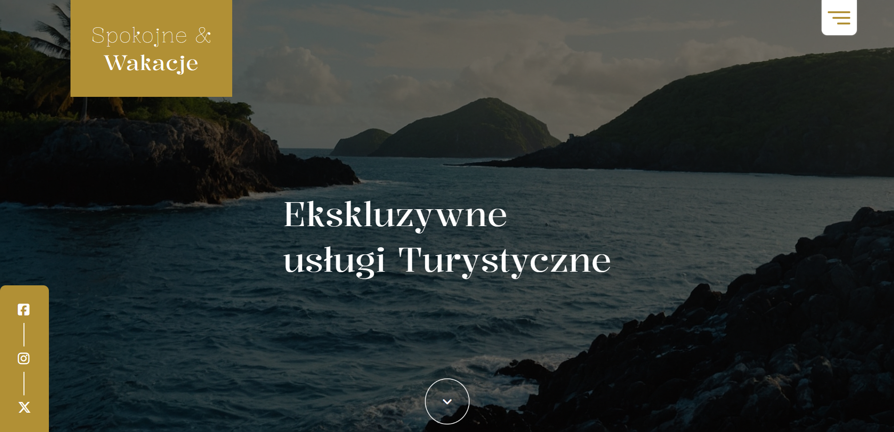
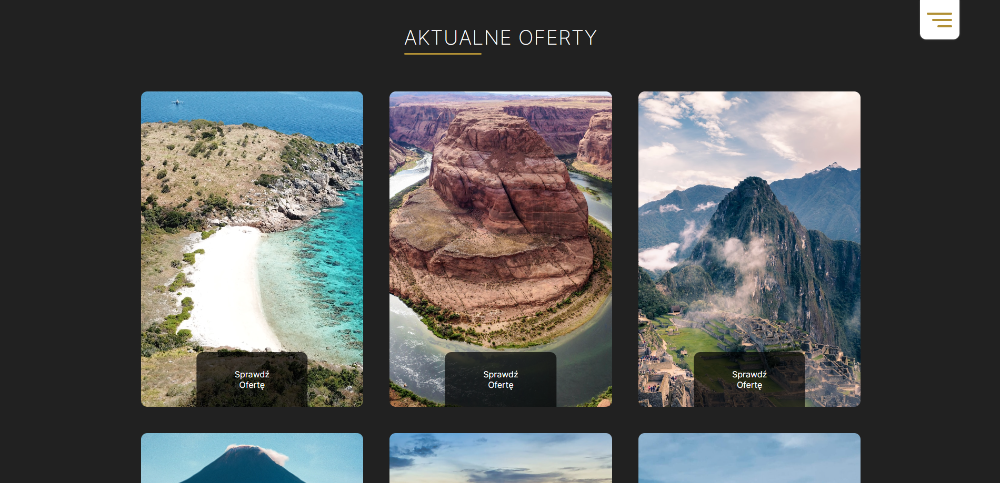

<h1 align="center">Tourist Site</h1>

  

  This is the website of the tourist office "peaceful vacations"  

  

## How to start  
To view the demo you need to go to the link provided below:

  

<a align="center" href='https://szafter12.github.io/Tourist-site-PL/'>View demo</a>

  

## About The Project

The site depicts a fictitious travel agency. The site serves as a business card of the company "peaceful vacations". the site has a photo gallery and offers tours that have very pleasant animations on the hover

### Built With

HTML
 
SCSS
 
JavaScript
 

## Contact

Jakub Pachut - jakubpachut@gmail.com

Project Link: https://github.com/Szafter12/Tourist-site-PL
